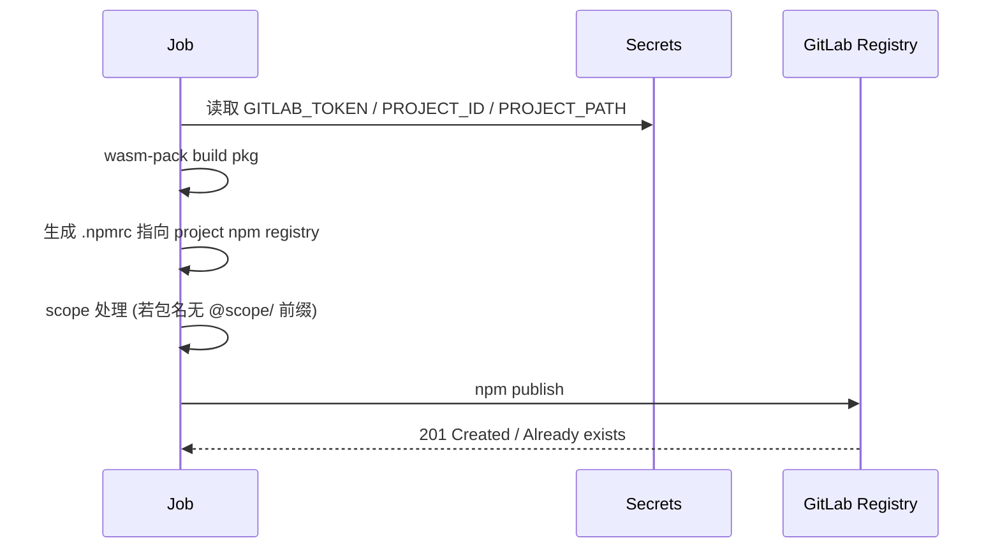

# Contributors Guide

> 面向希望参与 `source-map-parser` 开发与发布的贡献者。本指南涵盖：开发环境、代码规范、测试、版本与发布流程、CI/CD、Changelog 生成、跨平台与多 Registry 发布（crates.io / npm / GitLab）。

## 快速开始

1. 克隆仓库并进入目录：
   ```bash
   git clone git@github.com:MasonChow/source-map-parser.git
   cd source-map-parser
   ```
2. 安装 Rust stable（推荐使用 rustup，需 wasm 目标）：
   ```bash
   rustup target add wasm32-unknown-unknown
   ```
3. 运行全部测试（本地）：
   ```bash
   cargo test --workspace --exclude source_map_parser_node --all-features
   wasm-pack test --node crates/node_sdk
   ```
4. （可选）启用缓存 / 构建加速：配置 `sccache` 并导出 `RUSTC_WRAPPER=sccache`。

## 代码结构

- `crates/source_map_parser`：核心逻辑 (stack 解析 / token 映射 / context snippet / error stack 映射)。
- `crates/node_sdk`：WASM 导出 (Node 目标)，通过 `wasm-bindgen` 提供 JS 可调用接口。
- `scripts/`：自动化脚本（例如 `generate-changelog.sh`）。
- `.github/workflows/`：CI / Release Pipelines。

## 开发约定

- 采用 Rust 2021 edition；保持 `clippy` clean（后续可加入强制检查）。
- 测试命名：`*_test.rs` 或内联 `mod tests { ... }`；避免跨模块耦合。
- 新功能需至少包含：
  - 单元测试覆盖核心逻辑
  - 如影响 WASM API，补充 `node_sdk` 侧 wasm-bindgen 测试
- 提交信息推荐遵循 Conventional Commits：
  - `feat(scope): 描述`
  - `fix(scope): 描述`
  - `refactor: ...` / `perf: ...` / `docs: ...` / `test: ...` / `chore: ...`
  - 破坏性变更：`feat!: ...` 或正文含 `BREAKING CHANGE:`

## Changelog 生成逻辑

脚本：`scripts/generate-changelog.sh <version> [repo_url]`

- 自动检测最近 tag 与当前 HEAD 的提交区间
- 解析 Conventional Commit type(scope)!: 描述
- 输出分类 (Features / Fixes / Performance / Refactors / Docs / Tests / Build / CI / Style / Chore / Other / Breaking Changes)
- 自动生成 compare 链接（GitHub/GitLab）
- 提交哈希转为 commit 链接

### Mermaid：Changelog 生成流程

```mermaid
digraph G {
  rankdir=LR;
  A[读取最新 tag] --> B[git log 范围]
  B --> C[逐行解析 Conventional Commit]
  C --> D{匹配 type(scope)!}
  D --> E[分类聚合]
  D --> F[检测 BREAKING]
  E --> G[生成 Compare 链接]
  F --> H[Breaking Section]
  G --> I[写入新版本 Heading]
  H --> I
  I --> J[合并旧 CHANGELOG]
}
```

## 版本与 Tag 策略

- 手动 bump 两个 crate (`crates/source_map_parser` 与 `crates/node_sdk`) 版本号保持一致。
- `node_sdk` 中对核心 crate 需显式 `version = "x.y.z"`，以便 crates.io 发布。
- 创建 tag：`vX.Y.Z`；CI 中将校验 tag 与 crate versions 一致。
- 建议遵循 SemVer：
  - MINOR：新增功能向后兼容
  - PATCH：修复缺陷
  - MAJOR 或 feat!: 破坏性变更

## 发布流水线概览

触发：推送 `v*` tag。
包含 Job：版本校验测试 → 发布 crates.io → 发布 npm (wasm-pack) → 发布 GitLab Generic Packages & GitLab npm → GitHub Release。

### Mermaid：Release Pipeline

```mermaid
flowchart TB
  start([Push tag vX.Y.Z]) --> verify[verify-and-test]\n校验版本+测试+生成 CHANGELOG
  verify --> crates[publish-crates]\n cargo publish
  verify --> npmPub[publish-npm]\n wasm-pack + npm publish
  verify --> gitlab[publish-gitlab]\n generic + npm registry
  crates --> release[github-release]\n读取 changelog
  npmPub --> release
  gitlab --> release
  release --> done([Release 完成])
```

### GitLab 包与 npm Registry 发布

Job: `publish-gitlab`

- 生成 artifacts：两个 crate 的 `.crate` 打包 + wasm 打包 `tgz`
- 上传到 Generic Packages：`/packages/generic/source-map-parser/<version>/...`
- 若配置 GitLab npm：生成 `.npmrc` 并按需注入 scope 后 `npm publish`

### Mermaid：GitLab npm 发布



## 必要 Secrets (GitHub Actions)

| 名称                 | 用途                               |
| -------------------- | ---------------------------------- |
| CARGO_REGISTRY_TOKEN | 发布到 crates.io                   |
| NPM_TOKEN            | 发布到 npm registry (官方)         |
| GITLAB_TOKEN         | 上传 Generic Packages / GitLab npm |
| GITLAB_PROJECT_ID    | GitLab 项目 numeric id             |
| GITLAB_PROJECT_PATH  | GitLab 项目完整 path (用于 scope)  |

## 本地发布前检查清单

- [ ] 所有测试通过 (`cargo test`, `wasm-pack test --node`)
- [ ] Changelog 已根据提交适当书写（可运行脚本预览）
- [ ] crate 版本同步且未与已发布版本冲突
- [ ] 提交消息符合规范（尤其是 Breaking Changes）
- [ ] README 与文档更新（如 API 变更）

## 常见问题 (FAQ)

1. Q: 发布时报 path dependency 错误？
   A: 确认 `node_sdk` 中 `source_map_parser` 依赖包含 `version = "x.y.z"`。
2. Q: npm 包名需要自定义？
   A: 修改 wasm 构建产物前生成的 `pkg/package.json` 或在 GitLab job 中跳过重写逻辑。
3. Q: 没有触发 Release？
   A: 确认推送的是轻量 tag `vX.Y.Z` 且在默认远程 (origin) 上。
4. Q: GitLab npm 发布失败？
   A: 检查 `GITLAB_PROJECT_PATH` 与 Token 权限 (write_package_registry)。

## 后续增强建议

- 引入 `cargo-deny` / `clippy` as CI gates
- 自动版本号 bump + 变更文件回写 (Release PR 模式)
- 多平台编译验证 (aarch64, windows) + sccache
- CHANGELOG 添加 commit diff 链接到每条目 (目前仅哈希链接)

---

欢迎通过 Issue / PR 提交改进建议。🎉
